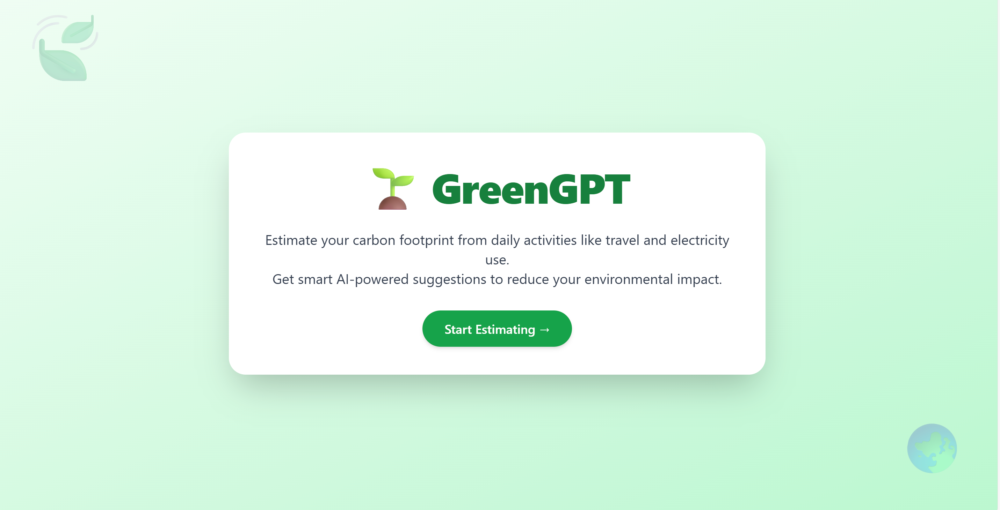
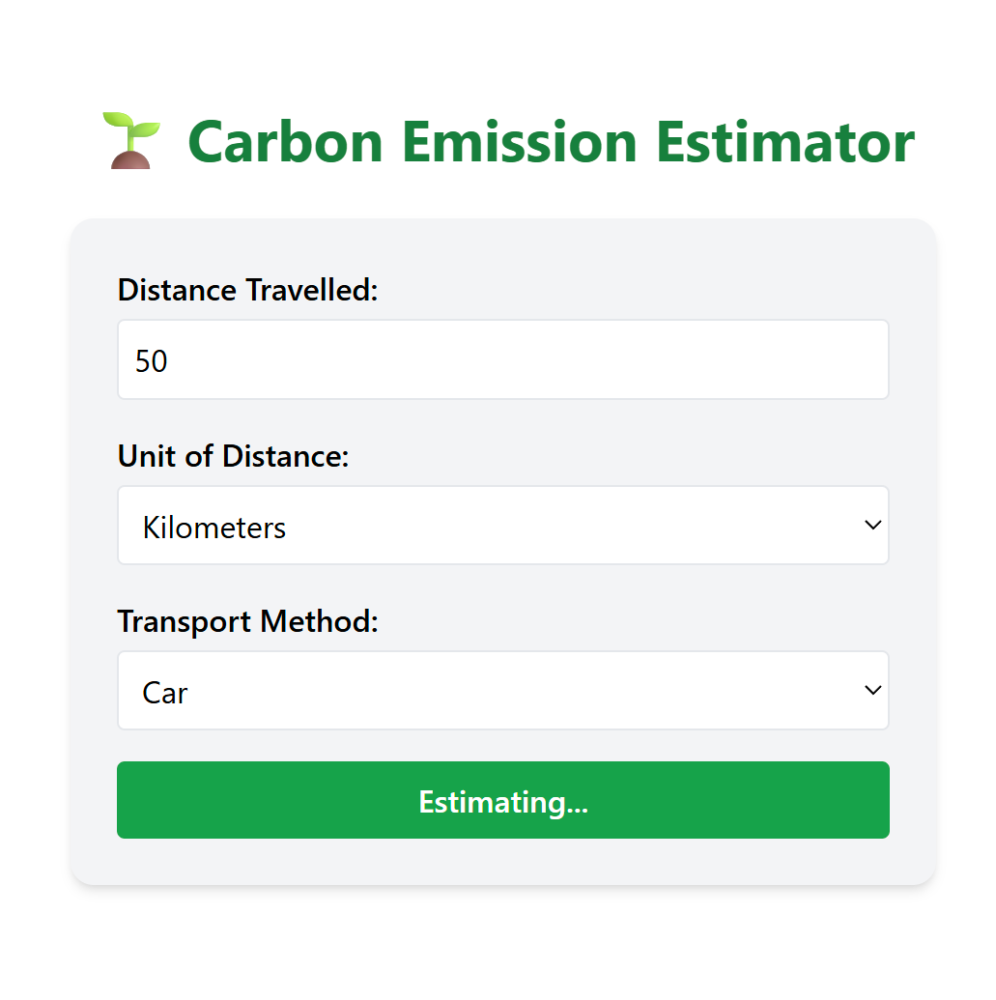
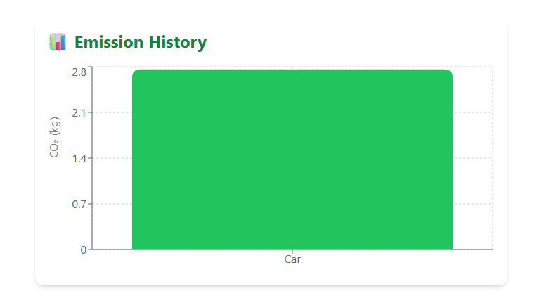
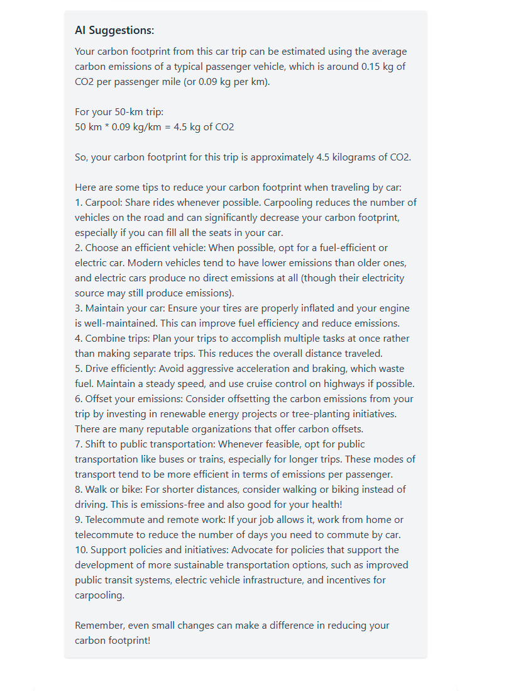

---

# 🌱 GreenGPT – AI Carbon Emission Estimator

GreenGPT is a smart web application that helps users estimate their **carbon emissions** based on travel distance and transportation mode. It also provides **AI-powered suggestions** using the **Cohere API** to reduce environmental impact.

---

## 📚 Table of Contents

* [🧮 Emission Calculation Logic](#-emission-calculation-logic)
* [🧠 AI Suggestions](#-ai-suggestions)
* [🛠 Tech Stack](#-tech-stack)
* [🧪 Setup Instructions](#-setup-instructions)
* [🔮 Future Enhancements](#-future-enhancements)
* [👥 Contributors](#-contributors)
* [🖼️ Screenshots](#️-screenshots)

---

## 🧮 Emission Calculation Logic

```js
const emissionFactors = {
  car: 0.12,
  bus: 0.05,
  truck: 0.25,
  bike: 0,
  cycle: 0,
  train: 0.04,
  ship: 0.15,
  aeroplane: 0.25,
  "electric vehicle": 0.03,
};

const estimatedEmission = emissionFactors[mode.toLowerCase()] * distance;
```

All values represent **kg of CO₂ per kilometer**.

---

## 🧠 AI Suggestions

We use the **Cohere API** to generate intelligent suggestions based on the user’s emissions.
Some examples include:

* Use electric or public transport when possible
* Reduce frequent short-distance car trips
* Walk or cycle for eco-friendlier options

---

## 🛠 Tech Stack

* **Frontend**: React.js + Vite + TailwindCSS
* **Backend**: Node.js + Express (Mock API)
* **Charting**: Recharts
* **AI Integration**: Cohere API
* **Version Control**: Git + GitHub

---

## 🧪 Setup Instructions

### 1. Clone the Repository

```bash
git clone https://github.com/KC-Chinmayi/Green_gpt.git
cd Green_gpt
```

### 2. Start the Frontend

```bash
cd frontend
npm install
npm run dev
```

### 3. Start the Backend

```bash
cd ../backend
npm install
node server.js
```

### 4. Create a `.env` File

Inside the `backend/` folder:

```env
COHERE_API_KEY=your-api-key-here
```

---

## 🔮 Future Enhancements

* 🔐 Add login/signup for personal emission tracking
* 📦 Store emission history using localStorage or database
* 🌍 Expand to other categories: food, home energy, digital habits

---

## 👥 Contributors

* [KC-Chinmayi](https://github.com/KC-Chinmayi)
* [Karuna-Nayak05](https://github.com/Karuna-Nayak05)

---

## 🖼️ Screenshots


### 🏠 Home Page



### 📝 Input Form


### 📊 Emission Chart


### 🤖 AI Suggestions



---

